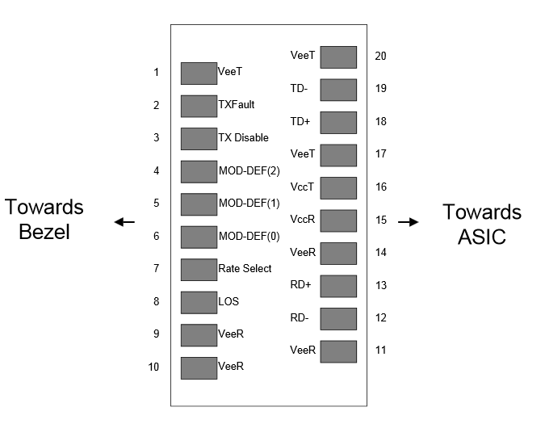

# SFP 'Info'

* 4 - MOD-DEF2 >[^3] 2 Wire Serial ID Interface > GPIO02 SDA1
* 5 - MOD-DEF1 >[^3] 2 Wire Serial ID Interface > GPIO03 SLC1
* 6 - MOD-DEF0 >[^3] Grounded in Module > GPIO04 GPIO_GCLK

[^3]: Mod-Def 0,1,2. These are the module definition pins. They should be pulled up with a
4.7K – 10KΩ resistor on the host board. The pull-up voltage shall be VccT or VccR (see
Section IV for further details).  
Mod-Def 0 is grounded by the module to indicate that the module is present  
Mod-Def 1 is the clock line of two wire serial interface for serial ID  
Mod-Def 2 is the data line of two wire serial interface for serial ID  

* SFF-8071 SFP+ 1X 0.8mm Card Edge Connector
* SFF-8418 SFP+ High Speed Electrical Interface
* SFF-8419 SFP+ Low Speed Electrical Interface
* SFF-8432 SFP+ Module and Cage
* SFF-8433 SFP+ Ganged Cage Footprints and Bezel Openings
* SFF-8472 SFP+ Management Interface 